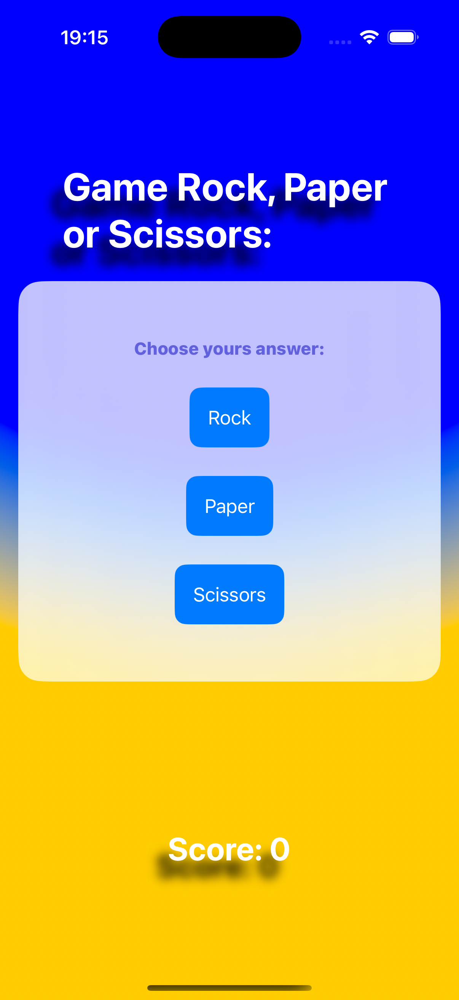

# Day 25 Challenge - game Rock, Paper, Scissors.

- Each turn of the game the app will randomly pick either rock, paper, or scissors.
- Each turn the app will alternate between prompting the player to win or lose.
- The player must then tap the correct move to win or lose the game.
- If they are correct they score a point; otherwise they lose a point.
- The game ends after 10 questions, at which point their score is shown.
