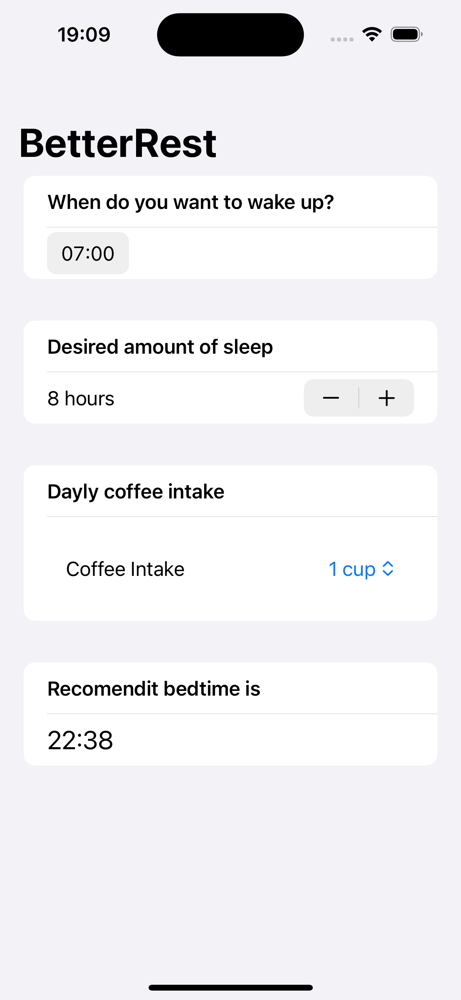

# Day 26-28 Project 4 Better Rest

📝 Topics:

    BetterRest: Introduction
    Entering numbers with Stepper
    Selecting dates and times with DatePicker
    Working with dates
    Training a model with Create ML
	
    Building a basic layout
    Connecting SwiftUI to Core ML
    Cleaning up the user interface
	
    BetterRest: Wrap up
    Review for Project 4: BetterRest

📷 Screenshot:

    

