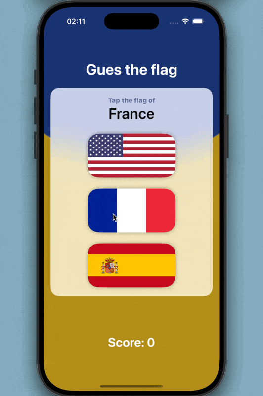

# Day 32-34 Project 6 Animation 

📝 Topics:

    
    Animation: Introduction
    Creating implicit animations
    Customizing animations in SwiftUI
    Animating bindings
    Creating explicit animations   
 
    Controlling the animation stack
    Animating gestures
    Showing and hiding views with transitions
    Building custom transitions using ViewModifier
	    
    Animation: Wrap up 
    Review for Project 6: Animation

📷 Screenshot:

    

🏆 [Challenges](https://www.hackingwithswift.com/books/ios-swiftui/animation-wrap-up)

