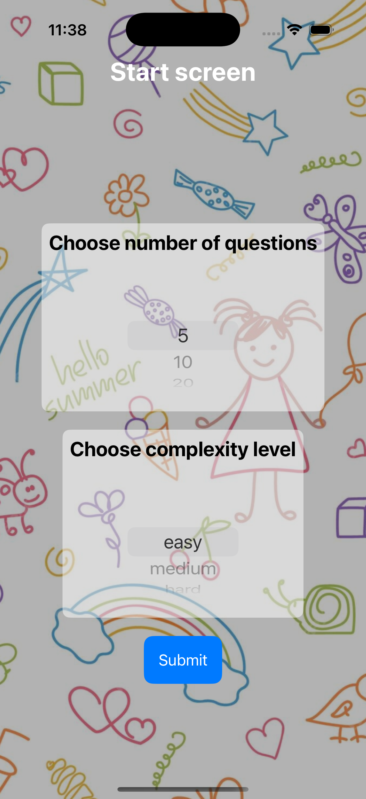
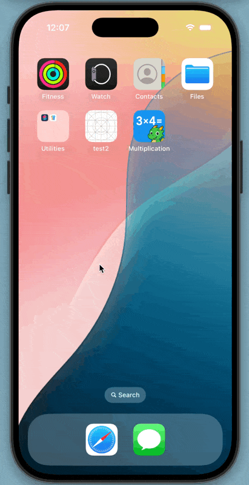

# Day 35 Milestone: Projects 4-6

Multiplication application

Your goal is to build an “edutainment” app for kids to help them practice multiplication tables – “what is 7 x 8?” and so on. Edutainment apps are educational at their core, but ideally have enough playfulness about them to make kids want to play.

📝 Topics:

    - The player needs to select which multiplication tables they want to practice. 
    This could be pressing buttons, or it could be an “Up to…” stepper, going from 2 to 12.
    
    - The player should be able to select how many questions they want to be asked: 5, 10, or 20.
	
    - You should randomly generate as many questions as they asked for, within the difficulty range they asked for.

📷 Screenshot:

    
    
    

