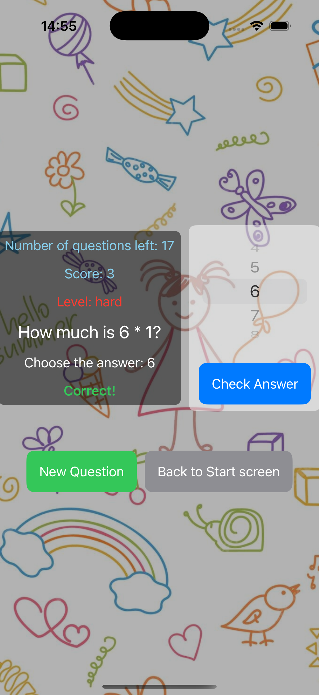

# Day 36-38 Projects 7

iExpense

📝 Topics:
    
    iExpense: Introduction
    Using @State with classes
    Sharing SwiftUI state with @Observable
    Showing and hiding views
    Deleting items using onDelete()
    Storing user settings with UserDefaults
    Archiving Swift objects with Codable

🎥 Record:

    

📷 Screenshots:

    
    

